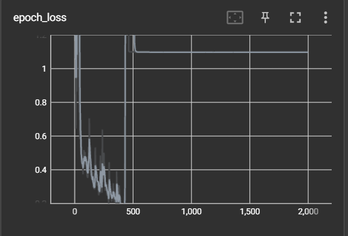

# Detecting Sign Language via Action Detection

### Dependency Notes 
1. To view tensorboard, downgrade protobuf from `3.20.3` to `3.20.1` via `pip install --upgrade protobuf==3.20.1`. Tensorboard can be brought up using `tensorboard --logdir=.`