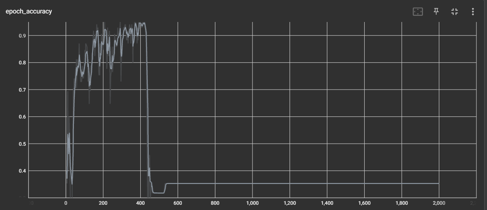

## Detecting Sign Language using action detection

### Overview 
This project entails the reading of sign language given an action by a user. The action is mapped to a dictionary that contain the meaning (word) of the action. The model is used is a LSTM Neural Network due to the sequential nature of the data. Each action contains a pre-defined number of frames of 30, which contains landmarks that are detected and stored MediaPipe as Numpy arrays. 

### Process 
1. Data Preparation: Using Mediapipe and OpenCV, individual actions are recorded and stored as frames. For sufficient training data, each action consist of 30 videos (Sequences). Each sequence are split into 30 frames, with each frame being represented as a numpy array with **all** landmarks (Face, limbs, fingers, etc). After capturing the actions, the arrays are then labelled with their corresponding action names for prediction after training.

2. The sequences of data are fed into the model which compromises of 3 LSTM and Dense layers, with a final `softmax` layer for prediction of action with the highest probability. The trained model is then exported as in `.h5` format and loaded for inference.

3. During inference, the probability distribution of each word is shown on the screen to monitor the model's accuracy. Words are also recorded to a sentence to keep track of its past predicted actions.

### Evaluation of Model 

### Dependency Notes 
1. To view tensorboard, downgrade protobuf from `3.20.3` to `3.20.1` via `pip install --upgrade protobuf==3.20.1`. Tensorboard can be brought up using `tensorboard --logdir=.`

### Mediapipe 
Mediapipe provides trained ML models for building pipelines to perform computer vision inference over arbitrary sensory data such as video or audio. In this case, it was used to detect facial and body features and outputted in the form of landmarks that are easily manipulated.